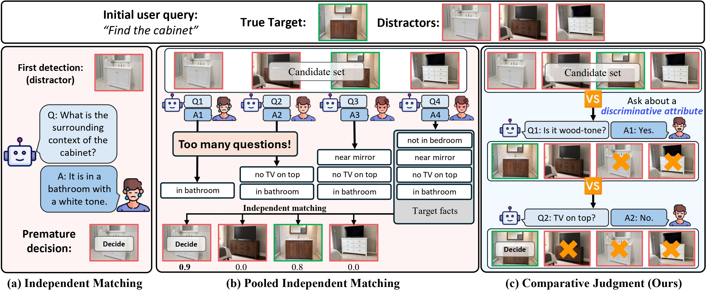
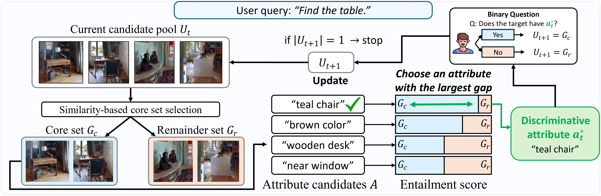

<div align="center">

# ProCompNav: Proactive Instance Navigation with Comparative Judgment for Ambiguous User Queries

**Junhyuk Kwon<sup>1</sup>, Seungjoon Lee<sup>2</sup>, Hyejin Park<sup>1</sup>, Kyle Min<sup>3</sup>, Jungseul Ok<sup>1,2</sup>**

<sup>1</sup>GSAI, POSTECH&nbsp;&nbsp; <sup>2</sup>CSE, POSTECH&nbsp;&nbsp; <sup>3</sup>Oracle

<a href="https://tree-jhk.github.io/procompnav/">

</a>
<a href="https://arxiv.org/abs/2605.06223">

</a>
<a href="https://arxiv.org/pdf/2605.06223">

</a>

</div>

---
<p align="center">
  
</p>

**ProCompNav** is a training-free, two-stage framework for instance navigation under ambiguous user queries. It first explores the scene to build a **candidate pool** of plausible targets, then disambiguates by *comparative judgment* — choosing, at each round, an attribute–value pair that **splits the current pool** into two non-empty groups, asking a single binary yes/no question, and pruning all inconsistent candidates at once.

Crucially, comparative judgment does not need an attribute that *uniquely identifies* the target. Every round only needs a valid splitter, whereas pooled independent matching — scoring each candidate against the user's description in isolation — is reliable only when the collected evidence is already sufficient to separate the target from its distractors. ProCompNav therefore reframes disambiguation from open-ended target description to **pool-level discriminative questioning**, where each question is chosen to narrow the candidate set.

---

## News

- **[2026/05]** Code released. End-to-end reproducible from a public CUDA base; verified against the reference environment.

---

## Method

<p align="center">
  
</p>

---

## Installation

The full environment is packaged as a Docker image. All Python dependencies are frozen in [`requirements.lock`](requirements.lock); every `git+` dep is pinned to a specific commit hash; `llama.cpp` is pinned to tag `b7628`.

```bash
git clone https://github.com/tree-jhk/procompnav.git
cd procompnav
docker build -t procompnav:latest .
```

The build pulls `nvidia/cuda:12.6.0-devel-ubuntu22.04`, compiles llama.cpp with CUDA, and installs the locked stack (PyTorch 2.9 + cu126, Habitat-Sim 0.2.4, GroundingDINO, MobileSAM, sentence-transformers, …). Expect ~45 minutes on a fast machine.

---

## Data & Weights

Set a host data root that will hold every dataset and weight not shipped in this repo. The launcher bind-mounts the same path inside the container, so absolute-path symlinks (common in HM3D scene folders) resolve transparently.

```bash
export PROCOMPNAV_DATA_DIR=$HOME/procompnav_data
mkdir -p $PROCOMPNAV_DATA_DIR
```

### 1. HM3D Scenes

You need a Matterport account. Register at [Matterport](https://matterport.com/habitat-matterport-3d-research-dataset) to obtain credentials.

```bash
export MATTERPORT_TOKEN_ID=<YOUR_TOKEN_ID>
export MATTERPORT_TOKEN_SECRET=<YOUR_TOKEN_SECRET>

# 3D scans (val split is sufficient for ProCompNav)
python -m habitat_sim.utils.datasets_download \
    --username $MATTERPORT_TOKEN_ID --password $MATTERPORT_TOKEN_SECRET \
    --uids hm3d_val_v0.2 \
    --data-path $PROCOMPNAV_DATA_DIR
```

After download you should have:

```
$PROCOMPNAV_DATA_DIR/scene_datasets/hm3d/hm3d_annotated_basis.scene_dataset_config.json
$PROCOMPNAV_DATA_DIR/scene_datasets/hm3d/val/<scene>/<scene>.{glb,semantic.glb,semantic.txt,basis.navmesh}
```

### 2. Instance Text-Goal Navigation (PSL benchmark)

Follow [PSL-InstanceNav](https://github.com/XinyuSun/PSL-InstanceNav) for context.

```bash
# Instance-ImageNav episode scenes (val)
wget https://dl.fbaipublicfiles.com/habitat/data/datasets/imagenav/hm3d/v3/instance_imagenav_hm3d_v3.zip
unzip instance_imagenav_hm3d_v3.zip -d $PROCOMPNAV_DATA_DIR/datasets/
rm instance_imagenav_hm3d_v3.zip

# Text-goal annotations
mkdir -p $PROCOMPNAV_DATA_DIR/datasets/instancenav/val
wget --no-check-certificate \
    "https://drive.google.com/uc?export=download&id=1KNdv6isX1FDZi4KCVPiECYDxijg9cZ3L" \
    -O $PROCOMPNAV_DATA_DIR/datasets/instancenav/val/val_text.json.gz

# Link episode content
ln -s $PROCOMPNAV_DATA_DIR/datasets/instance_imagenav_hm3d_v3/val/content \
      $PROCOMPNAV_DATA_DIR/datasets/instancenav/val/content
```

### 3. CoIN-Bench

Download the CoIN-Bench dataset (`val_seen`, `val_unseen`, `val_seen_synonyms`) from [`ftaioli/CoIN-Bench`](https://huggingface.co/datasets/ftaioli/CoIN-Bench) on HuggingFace. Follow the instructions at the upstream [CoIN repository](https://github.com/intelligolabs/CoIN) for setup details, and place the resulting `CoIN-Bench/` directory in the repo root.

### 4. Model Weights

`mobile_sam.pt`, `pointnav_weights.pth`, `spot_pointnav_weights.pth`, and `dummy_policy.pth` are already in [`data/`](data/). The remaining weights are downloaded separately.

**Local weight files** (place under `data/`):

```bash
# GroundingDINO (too large to live in git)
wget -O data/groundingdino_swint_ogc.pth \
    https://github.com/IDEA-Research/GroundingDINO/releases/download/v0.1.0-alpha/groundingdino_swint_ogc.pth
```

**HuggingFace cache** (point `HF_HOME` at a host directory; the launcher bind-mounts it):

```bash
export HF_HOME=$HOME/.cache/huggingface

# 1) Qwen3-VL-8B-Instruct GGUF — local LLM/MLLM via llama.cpp
huggingface-cli download Qwen/Qwen3-VL-8B-Instruct-GGUF \
    "Qwen3VL-8B-Instruct-F16.gguf" "mmproj-Qwen3VL-8B-Instruct-F16.gguf"

# 2) BLIP2 image-text-matching — value-map scoring
huggingface-cli download Salesforce/blip2-itm-vit-g

# 3) DINOv2-large — dense image embedding for candidate clustering
huggingface-cli download facebook/dinov2-large

# 4) all-MiniLM-L6-v2 — dense text embedding for candidate clustering
huggingface-cli download sentence-transformers/all-MiniLM-L6-v2

# 5) DeBERTa-v3-large MNLI — attribute–value entailment for comparative judgment
huggingface-cli download MoritzLaurer/DeBERTa-v3-large-mnli-fever-anli-ling-wanli
```

Models 2–5 are auto-downloaded by `transformers` on first run if missing, but pre-fetching avoids cold-start latency and unpredictable build-time network use.

### 5. Final layout

```
$PROCOMPNAV_DATA_DIR/
├── scene_datasets/
│   └── hm3d/
│       ├── hm3d_annotated_basis.scene_dataset_config.json
│       └── val/
│           └── <scene>/<scene>.{glb,semantic.glb,semantic.txt,basis.navmesh}
└── datasets/
    ├── instancenav/
    │   └── val/
    │       ├── val_text.json.gz
    │       └── content/ -> ../../instance_imagenav_hm3d_v3/val/content
    └── instance_imagenav_hm3d_v3/
        └── val/content/<scene>.json.gz
```

---

## Evaluation

All evaluations launch through [`run_experiments.py`](run_experiments.py), which generates a Docker `run` script and executes it. Two GPUs per invocation: one for the LLM (llama.cpp) server, one for the vision servers (GroundingDINO + BLIP2 + MobileSAM) and the policy.

### CoIN-Bench (main table)

```bash
# val_seen
python run_experiments.py \
    --task_type coin --split val_seen \
    --vllm_gpu 0 --vision_gpu 1 \
    --shard_size 50 --shard0 0 --shard1 1 \
    --eval_folder_name procompnav_coin_val_seen

# val_unseen
python run_experiments.py \
    --task_type coin --split val_unseen \
    --vllm_gpu 0 --vision_gpu 1 \
    --shard_size 50 --shard0 0 --shard1 1 \
    --eval_folder_name procompnav_coin_val_unseen

# val_seen_synonyms
python run_experiments.py \
    --task_type coin --split val_seen_synonyms \
    --vllm_gpu 0 --vision_gpu 1 \
    --shard_size 50 --shard0 0 --shard1 1 \
    --eval_folder_name procompnav_coin_val_seen_synonyms
```

### Instance Text-Goal Navigation (PSL val)

```bash
python run_experiments.py \
    --task_type text_goal --split val \
    --vllm_gpu 0 --vision_gpu 1 \
    --shard_size 50 --shard0 0 --shard1 1 \
    --eval_folder_name procompnav_textnav_val
```

### Parallel sharding

Each invocation occupies 2 GPUs and runs two shards in parallel. On an `N`-GPU host, run `N/2` invocations:

```bash
for i in 0 1 2 3; do
  python run_experiments.py \
      --task_type coin --split val_seen \
      --vllm_gpu $((2*i)) --vision_gpu $((2*i+1)) \
      --shard_size 50 --shard0 $((2*i)) --shard1 $((2*i+1)) \
      --eval_folder_name procompnav_coin_val_seen &
  sleep 30   # stagger to avoid llama.cpp port collisions
done
wait
```

### Flags

`python run_experiments.py -h` for the full list. Key ablation knobs:

| Flag | Default | Effect |
|---|---|---|
| `--enable_NLI_based` | `True` | NLI-based attribute–value question selection |
| `--enable_pbp_refinement` | `True` | Property-based pool refinement |
| `--pbp_refinement_thres` | `0.9` | Similarity threshold for pool refinement |
| `--enable_multi_view` | `True` | Multi-view candidate observation |
| `--enable_loop_value` | `True` | Loop-closure on value map |
| `--instance_grouping_method` | `dense_average_image_text` | KMeans / dense (image+text) variant |
| `--trigger_step` | auto (CoIN: 400, TextNav: 600) | Step after which question-asking is triggered |

---

## Outputs

```
logs/<eval_folder_name>/                  # stdout + structured per-episode json
~/procompnav_videos/<eval_folder_name>/   # rendered videos (if --save_video True)
```

Aggregate Success Rate (SR), SPL, and dialogue length:

```bash
python scripts/compute_info_averages.py --root logs/<eval_folder_name>
```

---

## Repository layout

```
procompnav/
├── Dockerfile                  # CUDA 12.6 + llama.cpp b7628 + Habitat 0.2.4
├── requirements.lock           # locked pip env (290 pinned packages)
├── run_experiments.py          # Docker-based launcher (entrypoint)
├── scripts/
│   ├── launch_qwen3_vl_8b_instruct_llamacpp.sh
│   ├── new_launch_vlm_servers.sh
│   ├── compute_info_averages.py
│   └── parse_jsons.py
├── vlfm/                       # ProCompNav policy + PBP module (built on VLFM)
│   ├── policy/
│   ├── mapping/
│   ├── vlm/                    # GroundingDINO/BLIP2/MobileSAM clients + PBP module
│   └── ...
├── config/                     # Hydra task / experiment configs
├── data/                       # MobileSAM + PointNav weights (GroundingDINO download separately)
├── GroundingDINO/              # GroundingDINO source (configs)
└── docs/
    └── figures/                # teaser.jpg, method.jpg
```

---

## Acknowledgements

This codebase is built upon [VLFM](https://github.com/bdaiinstitute/vlfm) and [AIUTA / CoIN](https://github.com/intelligolabs/CoIN). We thank the authors for their excellent work and for releasing their code and benchmarks.

---

## Citation

```bibtex
@article{kwon2026proactive,
  title={Proactive Instance Navigation with Comparative Judgment for Ambiguous User Queries},
  author={Kwon, Junhyuk and Lee, Seungjoon and Park, Hyejin and Min, Kyle and Ok, Jungseul},
  journal={arXiv preprint arXiv:2605.06223},
  year={2026}
}
```

---

## License

This repository is released under the terms of the [LICENSE](LICENSE) file.
